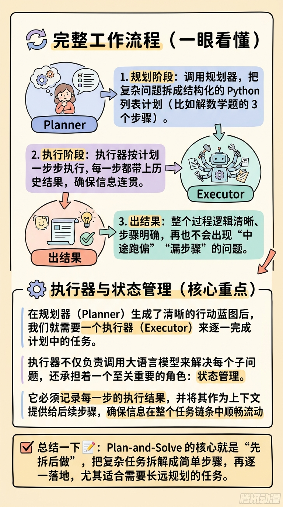
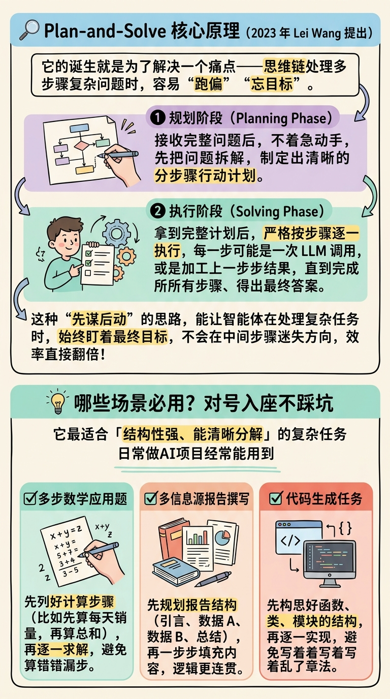
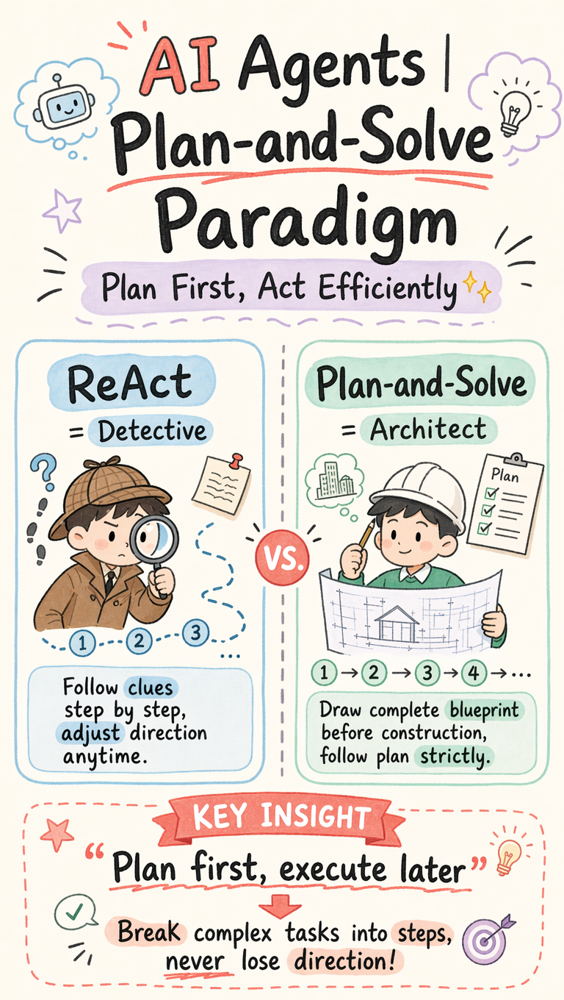
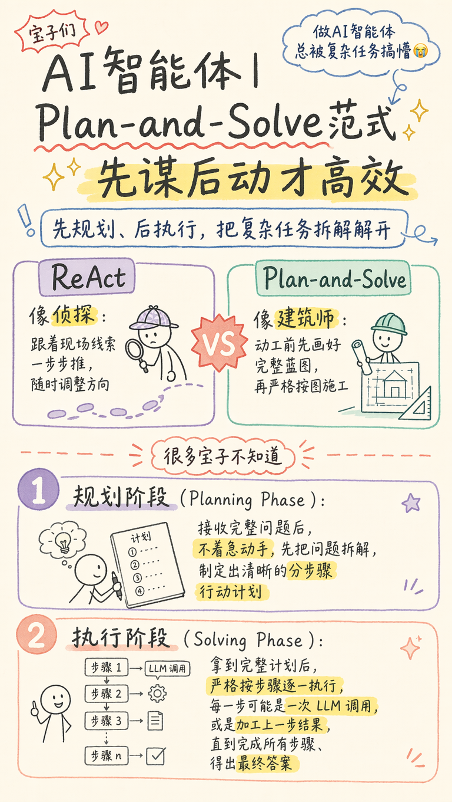

<div align="center">

# Text-to-Image Workflow · OpenStoryboard

<p>
  <strong>Turn text into image production pipelines automatically:</strong><br/>
  Analyze content -> Build outline -> Assemble prompts -> Batch render -> Export report
</p>

<p>
  <a href="#-quick-start"></a>
  <a href="#-workflow-modes"></a>
  <a href="#-mode-specific-parameters"></a>
  <a href="#-model-configuration-web--env"></a>
</p>

<p>
  <a href="#-project-overview">Overview</a> •
  <a href="#-example-outputs">Examples</a> •
  <a href="#-quick-start">Quick Start</a> •
  <a href="#-workflow-modes">Modes</a> •
  <a href="#-mode-specific-parameters">Parameters</a> •
  <a href="#-model-configuration-web--env">Model Config</a> •
  <a href="#-output-structure">Output Structure</a>
</p>

</div>

---

## Project Overview

`OpenStoryboard` is an automated workflow that transforms text into images. It is suitable for content creation, knowledge communication, operational visuals, and educational material generation.

You provide text, and the pipeline executes these steps:

1. Content analysis (`analysis.md`)
2. Structured outline (`outline.md`)
3. Per-image prompt files (`prompts/*.md`)
4. Image generation through backend renderer (`*.png`)
5. Run summary report (`report.json`)

---

## Use Cases

- Knowledge cards: tutorials, checklists, framework breakdowns
- Infographics: structured one-page visual explainers
- Comic storytelling: character dialogue and narrative explanation
- Article illustrations: chapter-by-chapter auto illustration
- Diagrams: architecture, flowchart, and sequence visuals
- Cover images: article, video, and campaign hero covers

---

## Example Outputs

<div align="center">
  <table>
    <tr>
      <td align="center">
        
        <br />
        <sub>Example 1</sub>
      </td>
      <td align="center">
        
        <br />
        <sub>Example 2</sub>
      </td>
      <td align="center">
        
        <br />
        <sub>Example 3</sub>
      </td>
    </tr>
    <tr>
      <td align="center">
        
        <br />
        <sub>Example 4</sub>
      </td>
      <td align="center">
        
        <br />
        <sub>Example 5</sub>
      </td>
      <td align="center">
        
        <br />
        <sub>Example 6</sub>
      </td>
    </tr>
    <tr>
      <td align="center">
        
        <br />
        <sub>Example 7</sub>
      </td>
      <td align="center">
        
        <br />
        <sub>Example 8</sub>
      </td>
      <td align="center">
        
        <br />
        <sub>Example 9</sub>
      </td>
    </tr>
    <tr>
      <td align="center">
        
        <br />
        <sub>Example 10</sub>
      </td>
      <td align="center">
        
        <br />
        <sub>Example 11</sub>
      </td>
      <td align="center">
        
        <br />
        <sub>Example 12</sub>
      </td>
    </tr>
  </table>
</div>

---

## Quick Start

### 1) Install dependencies

```bash
pip install -r requirements.txt
```

### 2) Prepare `.env` at repository root

```bash
# Windows PowerShell
Copy-Item .env.example .env
```

Fill your API keys and model names in `.env`.

### 3) Inspect available modes and backend

```bash
python -m openstoryboard.cli inspect --project-root .
```

### 4) Run a dry-run first (no rendering cost)

```bash
python -m openstoryboard.cli run \
  --project-root . \
  --mode image-cards \
  --topic "AI Learning Roadmap" \
  --content "Learn from fundamentals to practical projects in phased iterations with regular review" \
  --image-count 4 \
  --style sketch-notes \
  --layout balanced \
  --dry-run
```

### 5) Run actual rendering

```bash
python -m openstoryboard.cli run \
  --project-root . \
  --mode infographic \
  --topic "Agent Engineering Landscape" \
  --content-file runs/demo/source.md \
  --aspect-ratio 3:4 \
  --quality 2k
```

---

## Workflow Modes

| Mode | Purpose | Typical Output |
|---|---|---|
| `image-cards` | Visual cards and knowledge decomposition | Card series |
| `infographic` | Infographics and structured communication | Single-page or multi-page infographic |
| `comic` | Comic narrative and character dialogue | Multi-panel comic |
| `article-illustrator` | Automatic illustrations for long-form content | Section-level illustrations |
| `diagram` | Architecture/flow/sequence visualization | Technical diagrams |
| `cover-image` | Cover image design | Article/video cover |

---

## Mode-Specific Parameters

> Parameters are grouped by mode to avoid confusion across workflows.

### 0) Common Parameters for All Modes

| Parameter | Type | Default | Description |
|---|---|---|---|
| `mode` | string | - | Mode name (required) |
| `topic` | string | - | Topic (can be left empty in Web for auto inference) |
| `content` | string | `""` | Direct text input |
| `content_file` | string | `null` | Source file path (`txt/md/docx`) |
| `ref_images` | string[] | `[]` | Reference image path list (only valid in supported modes) |
| `image_count` | int | `4` | Number of output images |
| `aspect_ratio` | string | `3:4` | Image ratio |
| `quality` | enum | `2k` | `normal` / `2k` |
| `provider` | string | `null` | Image generation provider |
| `model` | string | `null` | Image model |
| `image_api_dialect` | string | `null` | Image API dialect |
| `dry_run` | bool | `false` | Generate planning files only, skip rendering |
| `generate` | bool | `true` | Whether to render images |
| `anchor_chain` | bool | `true` | Enable first-image style anchoring |
| `fail_fast` | bool | `false` | Stop immediately on first error |
| `skip_analysis_llm` | bool | `false` | Skip LLM content analysis |
| `skip_outline_llm` | bool | `false` | Skip LLM outline refinement |
| `output_root` | string | `runs` | Root directory for outputs |

### 1) `image-cards`

| Parameter | Available | Description |
|---|---|---|
| `style` | Yes | Card style |
| `layout` | Yes | Layout (`sparse/balanced/dense/list/...`) |
| `palette` | Yes | Color palette |
| `preset` | Yes | Preset (maps to style/layout/palette) |
| `lang` | Yes | Language preference |
| `tone` | No | Not used |
| `type` / `density` | No | Not used |

### 2) `infographic`

| Parameter | Available | Description |
|---|---|---|
| `style` | Yes | Infographic style |
| `layout` | Yes | Infographic layout template |
| `lang` | Yes | Language preference |
| `palette` | No | Not used |
| `tone` | No | Not used |
| `type` / `density` / `preset` | No | Not used |

### 3) `comic`

| Parameter | Available | Description |
|---|---|---|
| `style` | Yes | Comic style |
| `layout` | Yes | Panel layout |
| `tone` | Yes | Emotional tone |
| `lang` | Yes | Language preference |
| `palette` | No | Not used |
| `type` / `density` / `preset` | No | Not used |

### 4) `article-illustrator`

| Parameter | Available | Description |
|---|---|---|
| `type` | Yes | Illustration type (for example `infographic/scene/flowchart/...`) |
| `density` | Yes | Illustration density (`minimal/balanced/per-section/rich`) |
| `preset` | Yes | Preset (maps to type/style/palette) |
| `style` | Yes | Illustration style |
| `palette` | Yes | Color palette |
| `lang` | Yes | Language preference |
| `layout` | No | Not used |
| `tone` | No | Not used |

### 5) `diagram`

| Parameter | Available | Description |
|---|---|---|
| `layout` | Yes | Diagram type (`architecture/flowchart/sequence/...`) |
| `style` | Yes | Diagram style |
| `lang` | Yes | Language preference |
| `palette` | No | Not used |
| `tone` | No | Not used |
| `type` / `density` / `preset` | No | Not used |
| `ref_images` | No | Reference images are not supported |

### 6) `cover-image`

| Parameter | Available | Description |
|---|---|---|
| `style` | Yes | Cover style preset |
| `palette` | Yes | Cover color palette |
| `cover_type` | Yes | Cover type |
| `rendering` | Yes | Rendering style |
| `text_level` | Yes | Text density |
| `mood` | Yes | Mood intensity |
| `font` | Yes | Font style |
| `lang` | Yes | Language preference |
| `layout` / `tone` / `type` / `density` | No | Not used |

---

## Model Configuration (Web + .env)

You can configure models in two ways:

### A) Web settings page (recommended for day-to-day tuning)

Open `/settings` and fill:

- Text Model: `API Key` / `Base URL` / `Model`
- Image Model: `API Key` / `Base URL` / `Model` / `Provider` / `API Dialect`

After saving, values are written to `runs/web_settings.json`.

Best for:
- Frequent model switching
- Team demos and experiments
- Cases where you do not want to edit files

### B) Root `.env` file (recommended for stable deployment)

Place `.env` at repository root (you can copy from `.env.example`):

```env
# Text model (analysis/outline/prompt)
OPENSTORYBOARD_TEXT_API_KEY=sk-xxx
OPENSTORYBOARD_TEXT_BASE_URL=https://api.openai.com/v1
OPENSTORYBOARD_TEXT_MODEL=gpt-4o-mini

# Image model (final rendering)
OPENAI_API_KEY=sk-xxx
OPENAI_BASE_URL=https://api.openai.com/v1
OPENAI_IMAGE_MODEL=gpt-image-1
OPENAI_IMAGE_API_DIALECT=openai-native

# Optional
OPENAI_TEXT_MODEL=gpt-4o-mini
OPENAI_MODEL=gpt-4o-mini
```

Best for:
- Long-term local development
- Container deployment
- CI/CD and automation tasks

### Configuration Priority (Important)

#### Text model parameters

1. Explicitly provided in current request (if present)
2. Web settings value (`runs/web_settings.json`)
3. Root `.env` / system environment variables

#### Image model parameters

1. Explicitly provided in current request (`provider/model/image_api_dialect`)
2. Web settings value (`runs/web_settings.json`)
3. Root `.env` / system environment variables (`OPENAI_*`)

> In other words: you can tune with Web and keep defaults in `.env` at the same time.

---

## Web Interface

Start service:

```bash
uvicorn openstoryboard.web.app:app --host 0.0.0.0 --port 8000
```

Access URLs:

- Chinese: `http://localhost:8000/zh`
- English: `http://localhost:8000/en`
- Settings: `http://localhost:8000/settings`

Supported capabilities:

- Direct text input / document upload
- Reference image upload
- Task interruption
- Recent run history
- Independent text-model and image-model configuration

---

## Docker

### Build and run

```bash
docker build -t openstoryboard:latest .
docker run --rm -p 8001:8000 -v %cd%:/app -w /app openstoryboard:latest
```

### Compose

> The program automatically reads the root `.env` file

```bash
docker compose up --build -d
```

Browser URL: `http://localhost:8001/zh`

### Run CLI inside container

```bash
docker run --rm \
  -v %cd%:/app \
  -w /app \
  --entrypoint python \
  openstoryboard:latest \
  -m openstoryboard.cli run \
  --project-root /app \
  --mode image-cards \
  --topic "Knowledge Card Example" \
  --content "Output 4 pages of concise Chinese cards" \
  --image-count 4
```

---

## Output Structure

Each run writes output to `runs/<mode>/<topic>-<timestamp>/`:

- `analysis.md`: content analysis
- `outline.md`: structured outline
- `prompts/*.md`: per-image prompts
- `*.png`: generated images
- `report.json`: status, paths, commands, and logs

Example:

```text
runs/
└─ image-cards/
   └─ ai-roadmap-20260420-190107/
      ├─ analysis.md
      ├─ outline.md
      ├─ prompts/
      │  ├─ 01-cover-xxx.md
      │  └─ 02-content-xxx.md
      ├─ 01-cover-xxx.png
      └─ report.json
```

---

## FAQ

### 1) Why run `--dry-run` first?

Because you can validate analysis, outline, and prompts before paying rendering cost, which significantly reduces tuning overhead.

### 2) Can I stop a running task?

Yes. Click "Stop Current Run" in the Web UI, or call `POST /api/run/stop`.

### 3) How can I improve style consistency across multiple images?

Keep `anchor_chain=true` and fix the `style/layout/palette` combination. This typically produces more stable series-level visual consistency.

---

## Recommended Team Usage

For team collaboration, first define 2-3 default templates (style + layout + palette + aspect ratio) and write them into your internal SOP.

This helps new members quickly produce consistent-quality output, reduces repeated back-and-forth, and leaves more time for content quality.